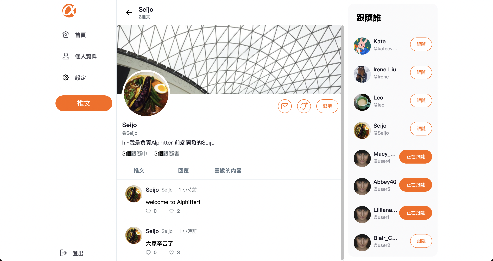

# Alphitter
Alphitter 是一個使用 Vue 2.6.11 開發，向 Twitter 致敬的微型專案。   
快來註冊Alphitter認識各式各樣的人，為自己的生活留下足跡，與其他人互動、留言、按讚，拓展自己的社交圈吧！

## 站內圖例
### 前台首頁

### 前台個人頁面

### RWD 支援平板瀏覽

### 後台首頁

### 登入頁


## 產品功能
1. 使用者可以註冊個人帳號，並使用個人帳號登入，編輯個人資料，包括名稱、帳號、密碼、email、介紹、個人顯示圖片及背景圖片。
2. 使用者可以發布自己的文字推文訊息。
3. 使用者可以瀏覽其他使用者的推文訊息，對推文新增回覆、按讚。
4. 使用者可以追蹤其他使用者或取消追蹤。
5. 使用者可以瀏覽其他使用者個人介紹頁面，瀏覽對方的歷史推文、留言、按讚的內容、追蹤中的使用者及追蹤該名使用者的清單。
6. 後台管理者可以瀏覽所有使用者以及所有發布的推文，並且管理者能夠刪除推文。

## 雲端部署 
> [專案連結](https://irene289.github.io/twitter-front-end-vue/#/)\
> 前端：Github page\
> 後端：伺服器部署於 Heroku，雲端資料庫則使用 Cleardb 儲存

## 專案開發人員
> **前端**\
> [SeijoHuang](https://github.com/SeijoHuang)\
> [IreneLIU](https://github.com/Irene289)\
> **後端**\
> [Kate-Chu](https://github.com/Kate-Chu)\
> [yanpin0524](https://github.com/yanpin0524)

## Github 連結
> [前端](https://github.com/Irene289/twitter-front-end-vue)  
> [後端](https://github.com/Kate-Chu/twitter-api-2020)


## 前端專案本地安裝流程
* 請確認電腦已經安裝 Vue 2.6.11、npm 
* 打開終端機，輸入以下指令將此專案 clone 到本地

```
git clone https://github.com/Irene289/twitter-front-end-vue.git
```
* 安裝套件

```
npm install
```
* 啟動專案

```
npm run serve
```
* 準備部署編譯打包時

```
npm run build
```

* Lints and fixes files

```
npm run lint
```


## 前端開發工具
1. Vue: 2.6.11
1. Vue CLI: 4.1.1
1. Vue-router: 3.5.1
1. Vuex: 3.6.2
1. axios: 0.19.2
1. sweetalert2: 9.17.2
1. sass: 1.51.0
1. sass-loader": 10.2.1
1. bootstrap: 5.1.3 (grid system only)
1. moment: 2.24.0
1. core-js: 3.6.5
